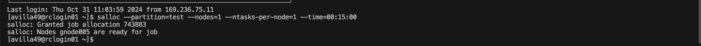
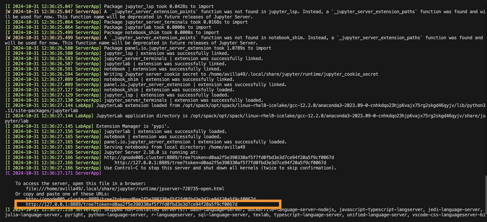

## Interactive jobs on cluster <!-- {docsify-ignore} -->
If you want to test out something but do not want to write an submission script. Interactive job will directly put you onto a compute node where you can use the compute node resources to test out the program. Here are some example commands where you can allocate different type of resources from compute node. 
1. Allocate appropriate CPU resources using the `salloc` command from the designated partitions on cluster.  
   ```bash
   salloc --partition=test --nodes=1 --ntasks-per-node=1 --time=00:15:00 
   ```
> This command will ask for 1 node and 1 task on the node for 15min. 
  
  You can also allocate GPU resources using the `salloc` command.
  ```bash
  salloc --partition=gpu --nodes=1 --gres=gpu:1 --time=00:15:00 
  ```
> This command will help you allocate 1 GPU resources from the gpu.q partition where this partition has the GPU nodes accessibility. 
2. After you allocate the desired resources and the allocated resources are available, you will be granted a job allocation number, an assigned node number. Example output is below:
Note: Job Allocation Number is unique for every single run, your outputted Job allocation number will be different. 
  
  You need to use the `srun` command to be placed to the compute node 
  ```bash
  srun --jobid=[Job Allocation Number] --pty /bin/bash  
  ```
  !> You need to make sure to replace the allocation number to whatever number that is assigned to you

3. After you are placed onto the desired node, you can directly execute the program you need, in this example, I am going to show you how to open a Jupyter Notebook on MERCED cluster compute node. 
   
   Let's load the anaconda module first. 
  ```bash
  module load anaconda3
  ```
4. Now it is the time to launch Jupyter notebook
  ```bash
  jupyter-notebook --no-browser --port=8889 --ip=0.0.0.0 
  ```
  After running this command, you will be given an url for the future step, circled in pink. 
  

5. Now you need to start a new terminal window and setup the tunnel as follow:
  ```bash
  ssh -N -f -L 8889:[allocated_node].cluster:8889 [UCMID]@login.rc.ucmerced.edu  
  ```
  !> Note: you need to replace the [allocated_node] to the assigned node that is outputted in step 2 and your the UCMID to your own UCMID(without the brackets).

6. Now you can open a web browser, copy and paste the URL from step 4. You will be able to access the jupyter notebook there. 
   
   !> Internet is not accessible on Compute Nodes, that means you will not be able to download files, clone a repo from GitHub, install packages, etc. You will need to perform these operations on the login node before starting the session. 
   
7.	Once you are done, terminate the ssh tunnel from step 5 by running `lsof -i tcp:8889` to get the PID and then `kill -9 <PID>`
8. You also need to exit the compute node from step 2 by typing `ctrl+d`, and you need to type `ctrl+d` again to exit the job if you are on the node shorter than the requested time limit. 
